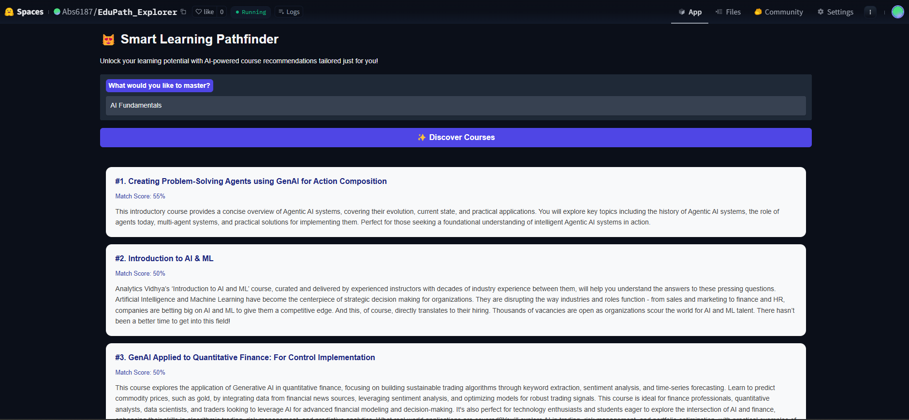

# EduPath Explorer 😻  

An AI-powered smart learning pathfinder designed to help users discover personalized educational courses tailored to their goals and interests.  

  

[**Live Demo**](https://huggingface.co/spaces/Abs6187/EduPath_Explorer)  

---

## 📖 About  

EduPath Explorer leverages advanced AI technologies to streamline the process of finding the right courses. Whether you're a beginner exploring new topics or a professional enhancing your expertise, EduPath Explorer ensures tailored recommendations that suit your learning journey.  

---

## ✨ Features  

- 😻 **Intuitive Interface**: User-friendly and visually appealing design for effortless navigation.  
- 🎯 **Precision Recommendations**: Smart AI-driven course matching based on user input.  
- 🔍 **Semantic Search**: Natural language processing for accurate and relevant results.  
- ⚡ **Real-Time Results**: Instant suggestions to save time and improve user experience.  
- 🎨 **Modern Design**: Clean, interactive UI built with Gradio.  

---

## 🚀 How to Use  

1. **Input Your Interests**: Enter topics or goals you'd like to learn about.  
2. **Discover Courses**: Click the "Discover Courses" button.  
3. **Review Recommendations**: Explore the personalized course results.  
4. **Learn and Grow**: Choose courses that fit your learning path.  

---

## 🛠️ Technology Stack  

- **Gradio 5.9.1**: For interactive and responsive user interfaces.  
- **OpenAI Embeddings**: Advanced NLP for semantic understanding.  
- **Vector Database**: Efficient storage and retrieval of course recommendations.  
- **Retrieval-Augmented Generation (RAG)**: Enhancing search accuracy with contextual generation.  
- **Modern UI/UX Design**: Seamless, minimalistic interface for an improved user experience.  

---

## 📜 License  

This project is licensed under the **GPL License**.  

For detailed configuration references, visit the [Hugging Face Spaces Documentation](https://huggingface.co/docs/hub/spaces-config-reference).  

---

## 👩‍💻 Contributions  

Contributions are welcome! If you’d like to improve or extend the functionality, feel free to open an issue or submit a pull request.  

---

## 📷 Screenshot  

  

---

## License

GPL License

Check out the configuration reference at https://huggingface.co/docs/hub/spaces-config-reference

